<p align="center">
  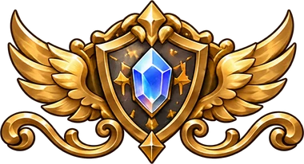
</p>

<h1 align="center">Brave Frontier: Reborn</h1>

<p align="center">
  <b>A free, browser-based tribute to the Omni/UBB era of <i>Brave Frontier</i>.</b><br>
  The battle system you remember, with original heroes, art, and story.
</p>

<p align="center">
  <a href="https://rebornbf.com"></a>
</p>

<p align="center">
  <a href="LICENSE"></a>
  
  
  
  
</p>

<p align="center">
  <a href="https://rebornbf.com"><b>Play</b></a>
  &nbsp;·&nbsp;
  <a href="https://rebornbf.com/product/docs"><b>Player docs</b></a>
  &nbsp;·&nbsp;
  <a href="https://github.com/AG9898/rebornbf/issues"><b>Report an issue</b></a>
</p>

> [!NOTE]
> **Unaffiliated tribute.** Brave Frontier: Reborn is a free, non-commercial fan project. It is not
> affiliated with or endorsed by the owners of *Brave Frontier*. No original game assets are used.
> See [`NOTICE`](NOTICE).

---

## About

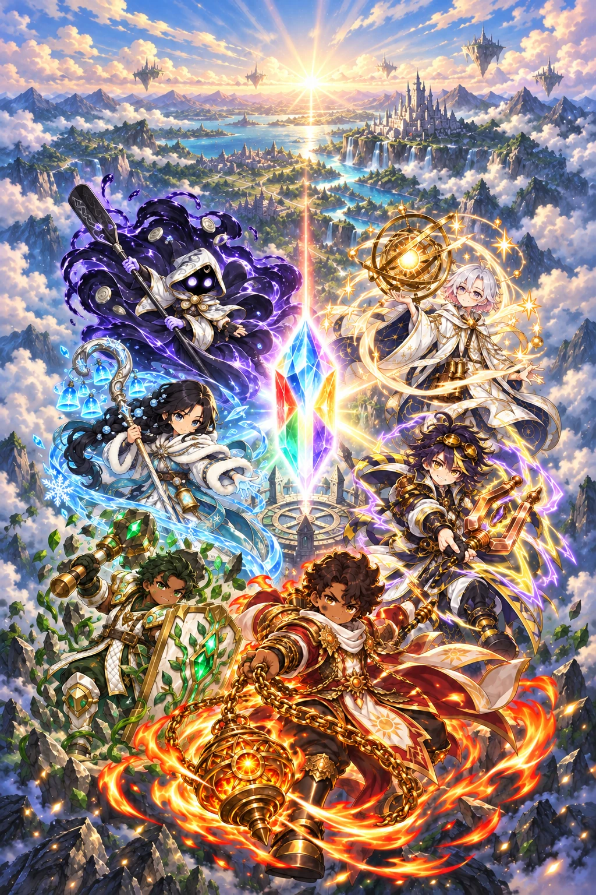

Brave Frontier: Reborn recreates the Omni/UBB-era battle system in the browser: tap-to-attack,
Brave Bursts, sparking, crystals, and the element wheel. The mechanics and unit kits follow the
original closely; every name, illustration, sprite, and line of story is our own.

Summon heroes, fuse and evolve them, equip spheres, and take a squad of five (plus an ally) down
the roads of **Brightmere Vale**.

Battles run on a pure, deterministic engine: the same seed and inputs always produce the same
result, so every reward is granted only after the server replays the fight.

<br clear="right">

## The heroes

The eight launch units, shown in their Omni forms.

<table align="center">
  <tr>
    <td align="center" width="25%">
      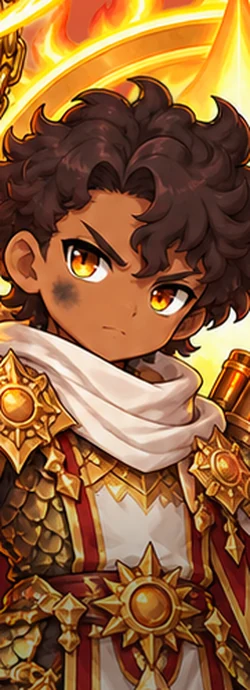<br>
       <b>Brand</b><br>
      <sub>Sunforge Sovereign</sub><br>
      <sub><i>Fire · Attacker</i></sub>
    </td>
    <td align="center" width="25%">
      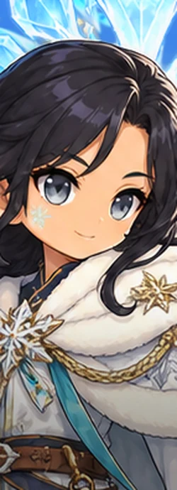<br>
       <b>Maren</b><br>
      <sub>Wintertide Sovereign</sub><br>
      <sub><i>Water · Healer</i></sub>
    </td>
    <td align="center" width="25%">
      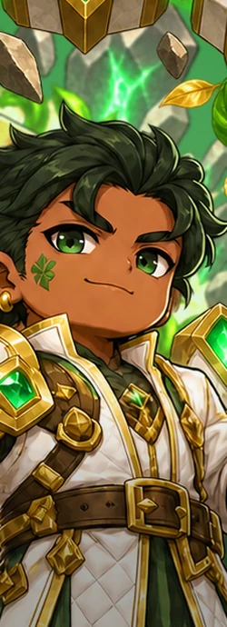<br>
       <b>Garrick</b><br>
      <sub>Heartstone Sovereign</sub><br>
      <sub><i>Earth · Tank</i></sub>
    </td>
    <td align="center" width="25%">
      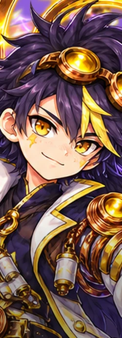<br>
       <b>Rook</b><br>
      <sub>Tempest Sovereign</sub><br>
      <sub><i>Thunder · Spark specialist</i></sub>
    </td>
  </tr>
  <tr>
    <td align="center">
      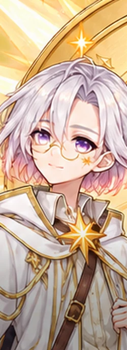<br>
       <b>Solen</b><br>
      <sub>Solstice Sovereign</sub><br>
      <sub><i>Light · Support</i></sub>
    </td>
    <td align="center">
      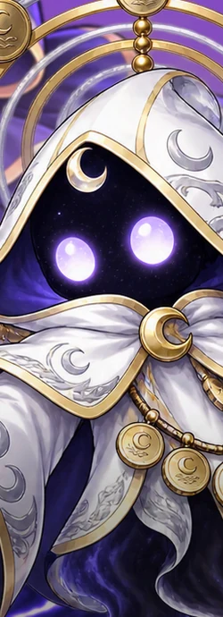<br>
       <b>Morrick</b><br>
      <sub>Nightshore Sovereign</sub><br>
      <sub><i>Dark · Mitigator</i></sub>
    </td>
    <td align="center">
      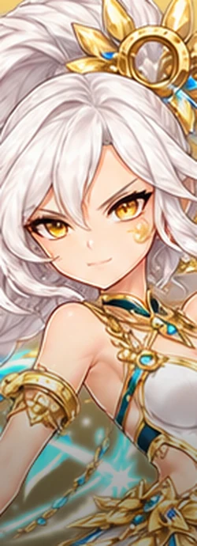<br>
       <b>Aurelle</b><br>
      <sub>Aurora Sovereign</sub><br>
      <sub><i>Light · Blade nuker</i></sub>
    </td>
    <td align="center">
      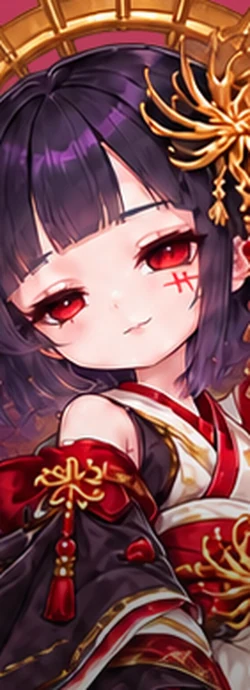<br>
       <b>Vespera</b><br>
      <sub>Nightbloom Sovereign</sub><br>
      <sub><i>Dark · Ailment nuker</i></sub>
    </td>
  </tr>
</table>

## Features

### The battle system

- **Tap to attack.** Each unit's attack hit frames are gameplay data, and hits that land together
  **spark** for bonus damage.
- **Brave Bursts.** Fill a unit's gauge to unleash its **BB**, **SBB**, or **UBB**. Defeated
  enemies drop **crystals** that fill BB gauges and restore HP.
- **The element wheel.**
   Fire beats
   Earth beats
   Thunder beats
   Water beats Fire;
   Light and
   Dark are strong
  against each other.
- **Leader skills, allies, and battle items**, plus Auto mode with per-unit priorities and x2 speed.

### Where to fight

<table>
  <tr>
    <td align="center" width="25%">
      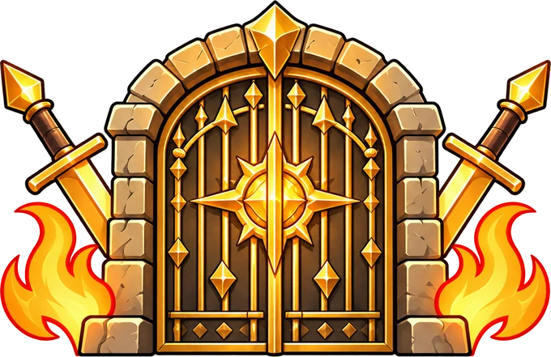<br>
      <b>Story quests</b><br>
      <sub>Two chapters across Brightmere Vale: <i>The Ember Road</i> and <i>The Saltglass Coast</i>.</sub>
    </td>
    <td align="center" width="25%">
      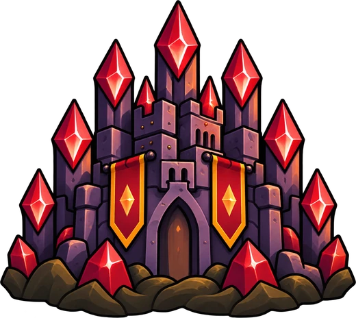<br>
      <b>Trials</b><br>
      <sub>Boss challenges in the Proving Lab, fought with three full squads in a row.</sub>
    </td>
    <td align="center" width="25%">
      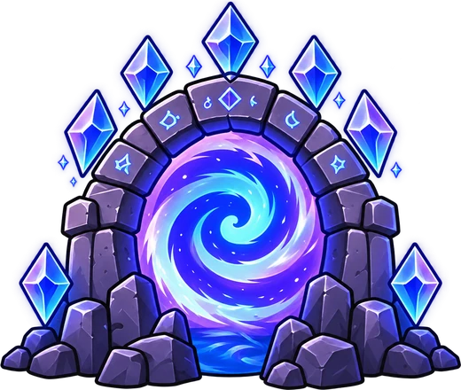<br>
      <b>Dungeons</b><br>
      <sub>Farming series for fusion fodder, evolution materials, items, hobs, and toads.</sub>
    </td>
    <td align="center" width="25%">
      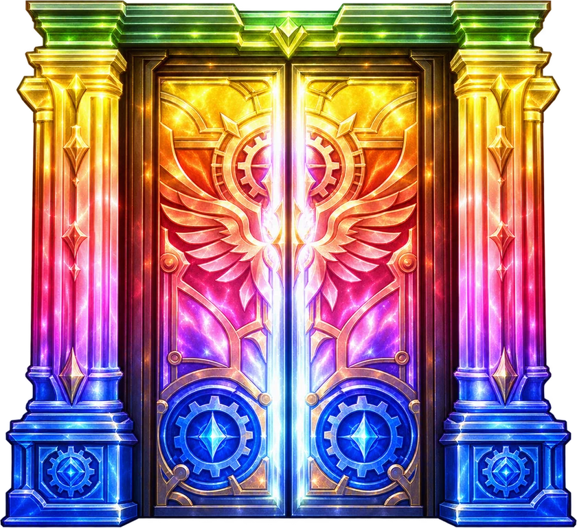<br>
      <b>Summons</b><br>
      <sub>Single and 10+1 pulls on the launch banner, opened gate by gate.</sub>
    </td>
  </tr>
</table>

### Growing your squad

- **Fusion** levels units with fodder and raises Brave Burst levels with duplicates.
- **Evolution** climbs each unit's star line up to Omni with materials from the dungeons.
- **Spheres** add passive bonuses, and **stat hobs** grant permanent stat gains.

<p align="center">
  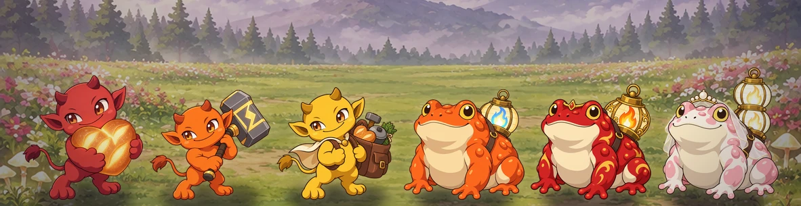
</p>

## This repository

This is a **read-only mirror** of the project's code, synced automatically from a private
repository. Its history is squashed sync commits.

**Pull requests are not accepted here.** [Issues](https://github.com/AG9898/rebornbf/issues) are
welcome; any fix is ported by hand.

### Layout

```
apps/web/        Next.js app: menus, Phaser battle scene, Supabase sign-in, public site
packages/engine/ Pure, deterministic battle engine (same seed + inputs = same result)
packages/data/   zod schemas and game content JSON (units, enemies, stages, banners)
supabase/        Postgres migrations, row-level security, RPC functions, pgTAP tests, content seed
```

## Run it locally

Requirements: Node.js 22+, pnpm (the version pinned in `package.json`), and Docker for the local
Supabase stack.

```bash
pnpm install
pnpm check                    # lint, typecheck, unit tests, content validation
pnpm --filter @bfr/web dev    # web app on http://localhost:3000
```

To sign in and play, run Supabase locally and fill in `.env.local` from `.env.example`:

```bash
cp .env.example .env.local
supabase start                # local Postgres + Auth; prints the URL and keys
supabase test db              # database tests
```

## License

The **code** is released under the [MIT License](LICENSE). **Art, audio, and written game
content** (character names, story, and descriptions) are **all rights reserved**; see
[`NOTICE`](NOTICE).

<p align="center">
  <sub>Brave Frontier: Reborn is an unaffiliated, non-commercial tribute. <i>Brave Frontier</i> and its
  characters, art, and trademarks belong to their respective owners.</sub>
</p>
